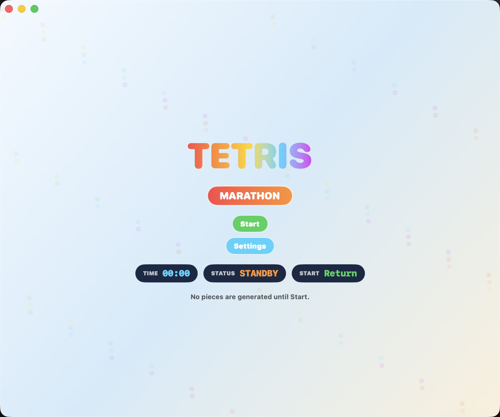

# Tetris

Mac native Tetris built with Swift, SwiftUI, and SpriteKit.

This project aims for a responsive Tetris Online Poland / Tetris Online Japan inspired feel, with testable core game rules separated from the SwiftUI and SpriteKit presentation layers.



## Features

- Swift Package Manager based macOS app
- SwiftUI app shell with SpriteKit playfield rendering
- 7-bag randomizer, Hold, Next queue, ghost piece, soft drop, and hard drop
- SRS-style rotation and wall kicks
- Lock Delay with reset limits
- T-Spin detection, Back-to-Back, REN combo tracking, and scoring
- Keyboard settings, DAS/ARR-style movement tuning, gravity tuning, and Japanese/English localization
- Voice feedback assets for line clears and special events
- Unit tests for the core rules and app-facing gameplay behavior

## Requirements

- macOS 14 or later
- Swift 6.2 toolchain
- Xcode with macOS SDK support

## Build

```sh
swift build
```

## Run

```sh
swift run TetrisApp
```

## Test

```sh
swift test
```

## Project Layout

- `Sources/TetrisCore/`: framework-independent game rules and scoring logic
- `Sources/TetrisApp/`: SwiftUI app, SpriteKit scene, settings, localization, and bundled resources
- `Tests/`: focused unit tests for core rules and app behavior
- `docs/`: requirements, design notes, manual playtest notes, and third-party notices

## License

MIT. See [LICENSE](LICENSE).
