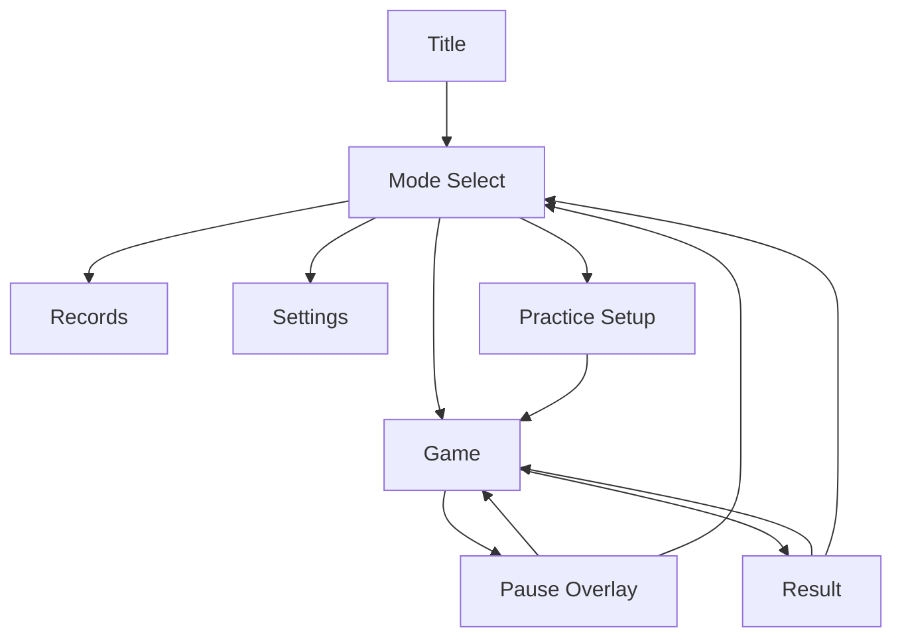

# Screen Design

## 目的

macOS ネイティブアプリとして、キーボード操作に集中できる Tetris 画面を設計する。TOP/TOJ 系のプレイ感に寄せ、Hold、Next、スコア、レベル、REN、Back-to-Back、T-Spin 表示を常時確認できる構成にする。

## 画面一覧

| 画面 | 役割 | 実装 |
| --- | --- | --- |
| Title | 起動直後の入口 | SwiftUI |
| Mode Select | モード選択 | SwiftUI |
| Game | プレイ画面 | SwiftUI + SpriteKit |
| Pause | 一時停止 | SwiftUI overlay |
| Result | リザルト | SwiftUI |
| Settings | キー・操作感・表示設定 | SwiftUI |
| Records | ローカル記録 | SwiftUI |
| Practice Setup | 練習設定 | SwiftUI |

## 全体ナビゲーション



## 共通デザイン方針

- デスクトップのキーボード操作を優先する。
- プレイ中の視線移動を少なくする。
- 装飾よりも視認性、入力応答性、情報密度を優先する。
- 色はミノの識別性を最優先し、背景は暗めまたは低彩度にする。
- T-Spin、Tetris、B2B、REN は短く強調表示する。
- UI アニメーションは入力や描画フレームを阻害しない軽量なものにする。

## Game 画面

### レイアウト

```text
┌────────────────────────────────────────────────────────────┐
│ Mode / Time / Status                                      │
├───────────────┬────────────────────────┬───────────────────┤
│ HOLD          │                        │ NEXT              │
│               │                        │                   │
│ Score         │      PLAY FIELD        │ Next 1            │
│ Level         │        10 x 20         │ Next 2            │
│ Lines         │                        │ Next 3            │
│               │                        │ Next 4            │
│ B2B / REN     │                        │ Next 5            │
│               │                        │                   │
├───────────────┴────────────────────────┴───────────────────┤
│ Event Message: T-SPIN DOUBLE / BACK-TO-BACK / REN           │
└────────────────────────────────────────────────────────────┘
```

### 領域

| 領域 | 内容 |
| --- | --- |
| Header | モード名、タイム、状態 |
| Left Panel | Hold、スコア、レベル、ライン数、B2B、REN |
| Center | SpriteKit のプレイフィールド |
| Right Panel | Next キュー |
| Event Area | 直近アクション表示 |

### プレイフィールド

- 10 x 20 の表示領域を中央に配置する。
- 上部のスポーン用非表示行は通常表示しない。
- グリッド線は薄く表示する。
- 現在ミノ、固定ミノ、ゴーストミノを区別する。
- ゴーストミノは半透明で表示し、ハードドロップ位置を示す。
- ライン消去時は短いフラッシュまたはフェードを行う。

### Hold

- 左上に表示する。
- Hold 未使用時は空枠を表示する。
- その手で Hold 使用済みの場合、Hold 枠を少し暗くして再使用不可を示す。

### Next

- 右側に縦並びで 5 個表示する。
- 設定で 6 個以上に増やせる。
- 最初の Next を大きめに、以降を少し小さく表示する。

### スコア/状態表示

常時表示:

- Score
- Level
- Lines
- Time
- REN
- B2B
- T-Spin count

表示ルール:

- REN は 1 以上の時に強調する。
- B2B 継続中は `B2B` を常時点灯させる。
- レベル上昇時は `LEVEL UP` を短く表示する。
- 自然落下速度の上昇は、Level 表示と一緒に伝える。

### イベント表示

中央下部またはフィールド脇に、直近イベントを短時間表示する。

優先順位:

1. T-SPIN TRIPLE
2. T-SPIN DOUBLE
3. T-SPIN SINGLE
4. TETRIS
5. BACK-TO-BACK
6. REN
7. LEVEL UP

複数イベントが重なる場合は、主イベントを大きく、B2B/REN を補助表示にする。

## Pause 画面

Game 画面の上に半透明オーバーレイで表示する。

表示項目:

- Resume
- Restart
- Settings
- Quit to Mode Select

Pause 中はゲーム時間、自然落下、Lock Delay、入力処理を停止する。Resume 時は即座にプレイ画面へフォーカスを戻す。

## Result 画面

プレイ終了時に表示する。

表示項目:

- Mode
- Score
- Time
- Lines
- Level
- Max REN
- Max Back-to-Back
- T-Spin count
- T-Spin Double count
- Best 更新表示

操作:

- Retry
- Back to Mode Select
- View Records

40 Lines では Time を最上位に表示する。Marathon / Challenge では Score を最上位に表示する。

## Mode Select 画面

モードを選択する画面。

表示モード:

- Marathon
- 40 Lines
- Challenge
- Practice
- VS COM
- Multi

初期実装では VS COM と Multi は disabled 表示にする。選択できないモードも将来予定として存在は示す。

各モードカードに表示する情報:

- モード名
- ベストスコアまたはベストタイム
- 最近の記録
- 簡単な状態ラベル

## Settings 画面

キー設定と操作感を調整する。

### Input

| 設定 | UI |
| --- | --- |
| Move Left | key capture |
| Move Right | key capture |
| Soft Drop | key capture |
| Hard Drop | key capture |
| Rotate CW | key capture |
| Rotate CCW | key capture |
| Rotate 180 | key capture |
| Hold | key capture |
| Pause | key capture |
| Restart | key capture |

### Handling

| 設定 | 初期値 | UI |
| --- | ---: | --- |
| DAS | 120 ms | stepper / slider |
| ARR | 16 ms | stepper / slider |
| SDF | 20x | stepper / slider |
| Lock Delay | 500 ms | stepper / slider |
| Lock Reset Limit | 15 | stepper |
| Next Count | 5 | stepper |

### Display

| 設定 | 内容 |
| --- | --- |
| Ghost Piece | on/off |
| Grid | on/off |
| Line Clear Effect | low/normal |
| Event Text | compact/normal |
| Fullscreen on Launch | on/off |

## Records 画面

モードごとのローカル記録を表示する。

表示項目:

- Marathon best score
- 40 Lines best time
- Challenge best score
- Max REN
- Max Back-to-Back
- T-Spin total
- T-Spin Double total
- Updated at

## Practice Setup 画面

練習モードの開始前設定。

設定項目:

- Gravity: normal / slow / fixed / none
- Lock Delay
- Fixed Seed
- Custom Piece Sequence
- Board Preset
- T-Spin Practice Preset
- Infinite Retry

T-Spin 練習プリセットでは、T-Spin Single / Double / Triple の代表形を選べるようにする。

## macOS ウィンドウ設計

- 初期ウィンドウサイズは 1280 x 800 を目安にする。
- 最小サイズは 960 x 640 とする。
- フルスクリーン対応。
- ウィンドウサイズ変更時もプレイフィールドのセルは正方形を維持する。
- プレイ中にウィンドウが非アクティブになった場合、自動ポーズする設定を提供する。

## SpriteKit 描画設計

Game 画面の中央は `SKScene` で描画する。

描画ノード:

```text
GameScene
  backgroundLayer
  gridLayer
  lockedBlocksLayer
  ghostPieceLayer
  activePieceLayer
  lineClearEffectLayer
  eventEffectLayer
```

描画更新:

- Domain の `RenderState` を受け取って差分反映する。
- ミノ移動は入力に即応させる。
- ライン消去演出中も次の状態更新をブロックしない設計にする。
- 重いパーティクルや過度な発光は使わない。

## アクセシビリティ/可読性

- ミノ色だけでなく形状でも識別できる。
- イベントテキストは短く、英字大文字で統一する。
- 数値情報は桁が増えてもレイアウトが崩れない幅を確保する。
- キー設定画面では重複キーを検出して警告する。

## 受け入れ基準

- Game 画面で Hold、Next 5 個、Score、Level、Lines、REN、B2B が常時見える。
- ライン消去数が増えると Level が上がり、画面上でも確認できる。
- Level Up 時に短い表示が出る。
- 接地後も Lock Delay 中は左右移動・回転が可能である。
- T-Spin Double 成功時に `T-SPIN DOUBLE` が明確に表示される。
- B2B 継続時に `B2B` が表示される。
- Settings 画面で DAS、ARR、SDF、Lock Delay を変更できる。
- macOS のウィンドウリサイズ時もフィールドセルが正方形を維持する。
